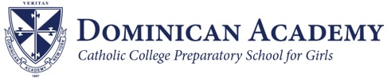
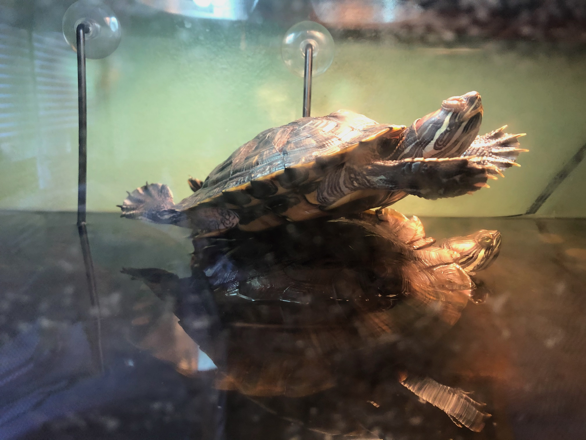
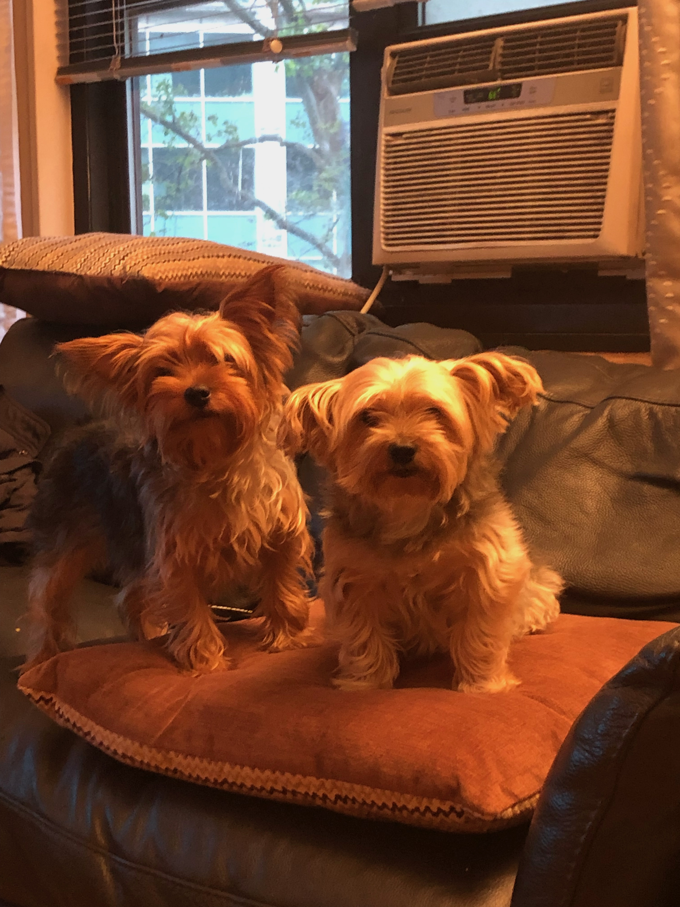
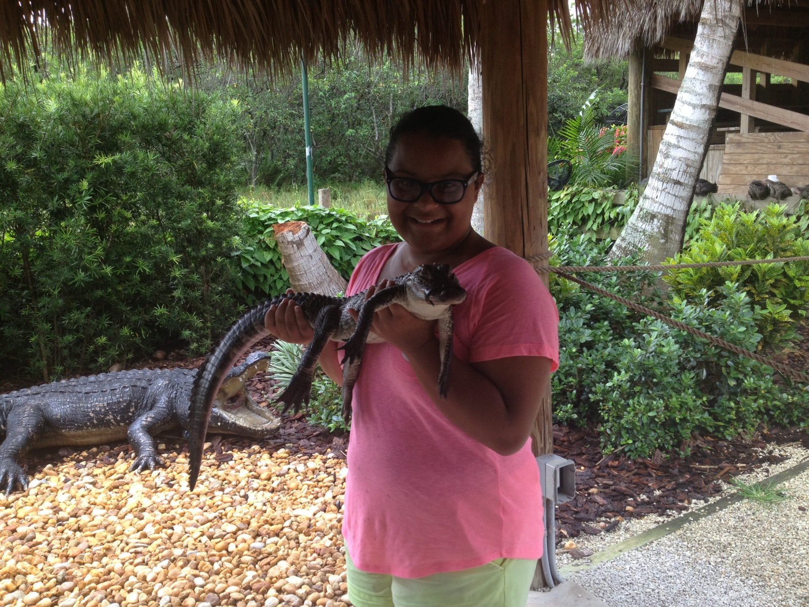

# Schooling

## High School

I went to an all female college preparatory Catholic high school in New York City named Dominican Academy. 

## University 

I am currently a junior Computer Science major at Quinnipiac University.

# What got me into the field

I first developed my love for coding and technology from being the most technologically advanced person in my family so I became the family issued _IT department_ that was open **24/7**. I then continued to develop my love with Girls Who Code during my sophmore year of high school which I was extremely involved in until my senior year of high school. Seeing my interest in Girls Who Code, my technology teacher had me enrolled in Computer Science my junior year of high school and from that moment on I knew I wanted to major in Computer Science.

# Facts about Me 

- Age: 20
- Birthday: September 18th 
- Zodiac Sign: Virgo
- 16Personality type: ENFJ
- Sibilings: 0 (_I prefer it this way_)
- Pets: 4 (_2 dogs and 2 turtles_)

# My Pets and I 

**My Turtles**

**My Dogs**

**Me**

